🛍️ BlackYellow — Full-Stack E-Commerce Application

A production-ready full-stack e-commerce web application built with React, Zustand, Node.js, Express, MongoDB, and JWT authentication using HttpOnly cookies.

Users can browse keyboards, filter by brand, search products, manage their cart, and maintain a persistent authenticated session.

---

🚀 Live Demo

https://black-yellow-eta.vercel.app/

(Frontend deployed on Vercel, Backend on Railway)

---

✨ Features Overview
👤 Authentication

-User registration & login

-JWT authentication stored in HttpOnly cookies

-Automatic session restoration

-Protected routes (frontend + backend)

-Logout with secure cookie clearing

---

🛒 Shopping Cart

-Add / remove items

-Auto-increase quantity for repeated items

-Cart stored per user in MongoDB

-Automatically loads after login

-Zustand ensures real-time UI updates

---

🛍️ Product Browsing

-Brand filtering

-Keyword search

-Price sorting

-Pagination

-Responsive UI with Chakra UI

-ProductCard component for modular rendering

---

🛠️ Admin Dashboard (Role-Based Access)

The application includes a full role-based Admin Dashboard accessible only to authenticated users with role: "admin".

Admin Capabilities

\*Products

-Create products

-Edit product info

-Delete products

-View inventory list

\*Orders

-View all customer orders

-Inspect items, totals, and timestamps

-Update order status

\*Users

-View all registered users

-Inspect user roles

-Promote / demote roles

-Remove accounts

\*Access Control

-JWT verification middleware

-Role-based authorization

-Frontend route guards

🧠 Tech Stack
Frontend

React + Vite

Zustand (global state management)

React Router

Chakra UI

Custom fetch wrapper (api.js) with credentials support

Backend

Node.js + Express

MongoDB + Mongoose

JWT + HttpOnly cookies

Role-based middleware

RESTful API architecture

## 📸 Screenshots

### 🏠 Home Page

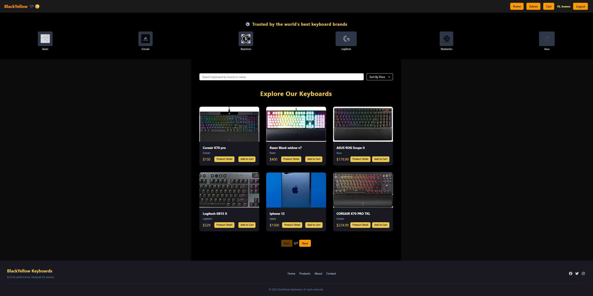

---

### 🔐 Authentication

#### Login Page

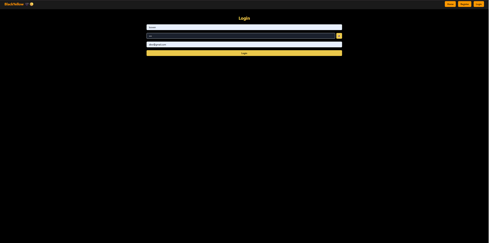

#### Register Page

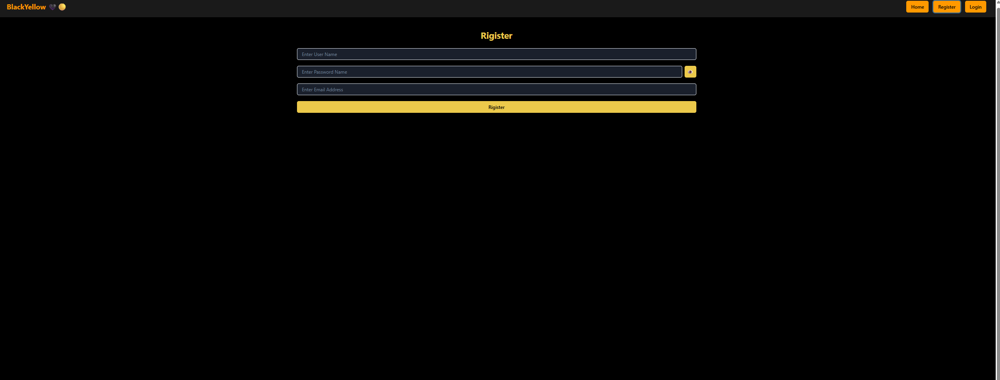

#### Login as Admin

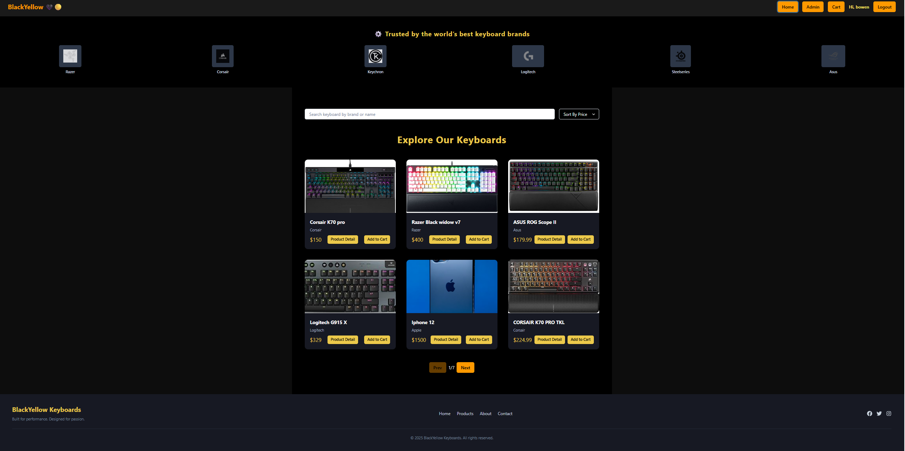

---

### 🛍️ Product Browsing

#### Cart Page

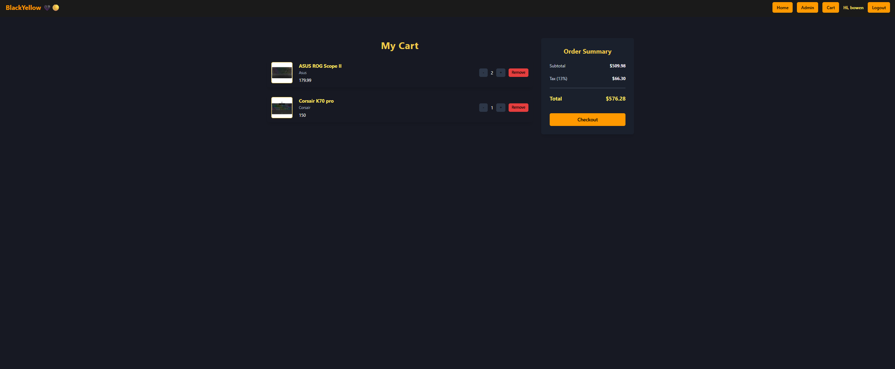

#### Checkout Page

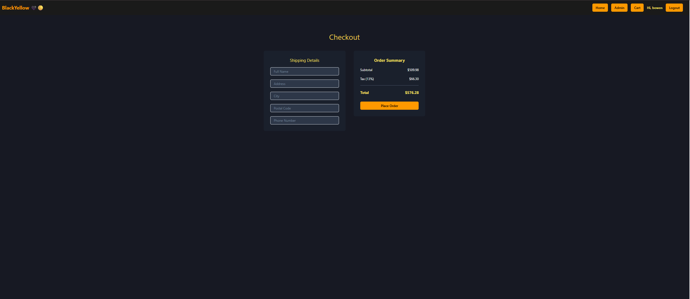

#### Place Order

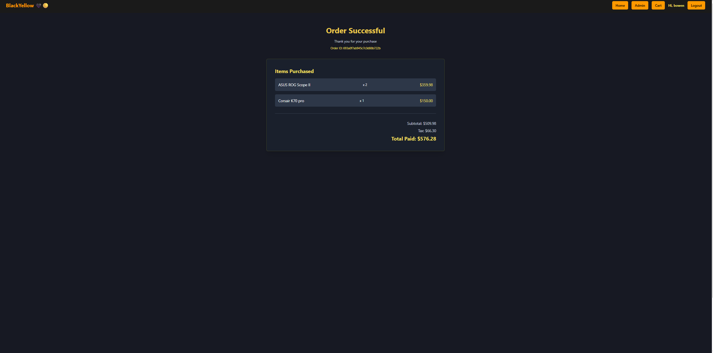

---

## 🛠️ Admin Dashboard

### Dashboard Overview

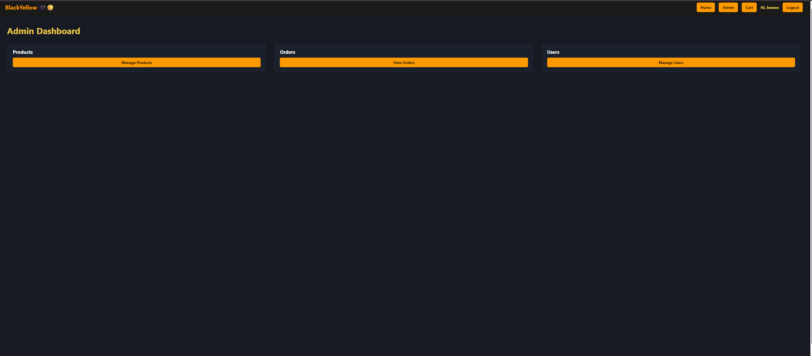

### Manage Products

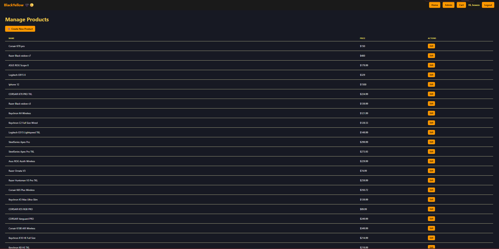

### View Orders

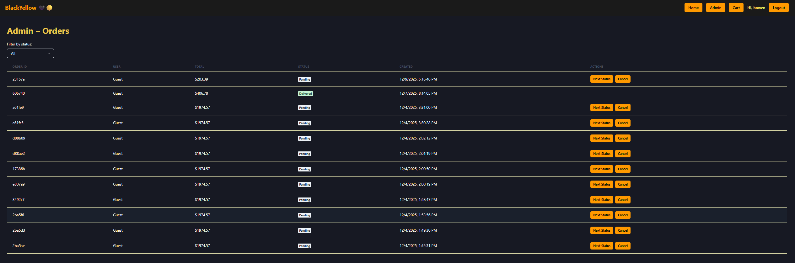

### Manage Users

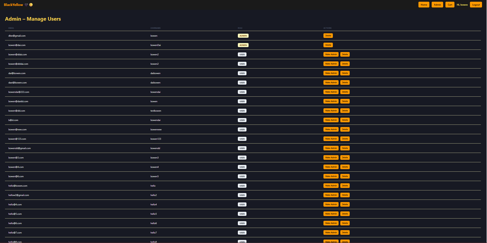
